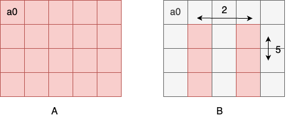
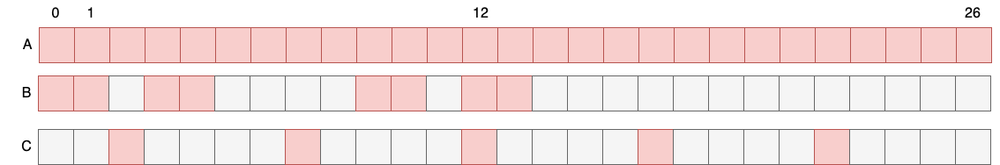
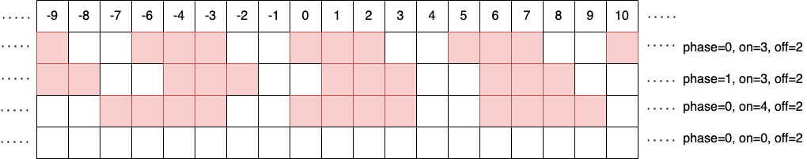
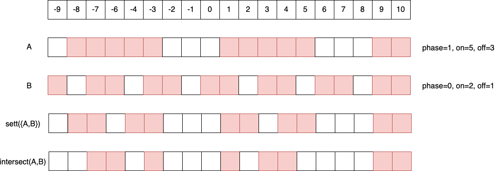
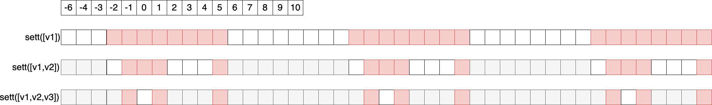
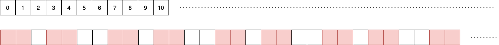
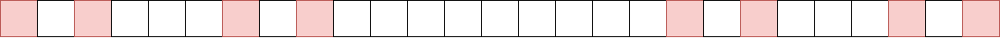
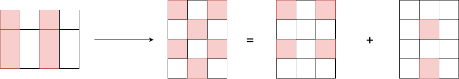
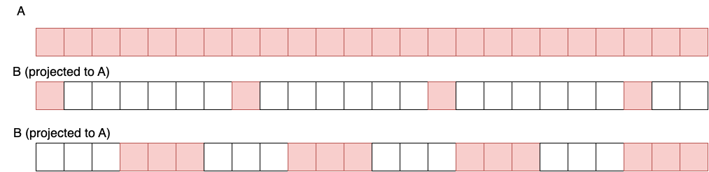
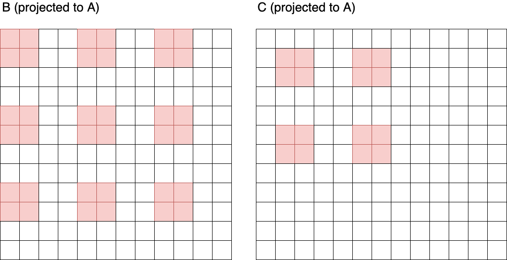

## Introduction

The location in memory of elements of numpy arrays can always be described with
 1. A pointer
 2. A shape
 3. An offset from the pointer to element at index (0,..,0)
 4. The strides in each dimension.

For example consider the code

```python
import numpy as np
A = np.empty([4,5])
B = A[1::, 1::2]
```

We call `B` a **view** into `A` as it refers to the same memory as `A`.




The 4-point description above for `B` is

1. The location of the first element of A: a0 in the diagram above.
2. The shape of B: 3x2.
3. The offset to the first element of B: 6 (A is row-major).
4. The strides in the 2 dimensions: 5 and 2.


This **ptr-offset-strides** description propagates through numpy slices and transposes. For example if

```python
A = np.empty([6,7])
B = A[1:5:2, 0:6:3].T
```


then `B` has strides 14 and 2. The ptr-offset-strides description does not always propagate through  reshapes, 
because not all reshapes can be described in ptr-offset-strides format. Consider


```python
A = np.empty([6])
B = np.reshape([2,3])
C = A[:,0:2]
D = A.reshape([4])
```

If `D` were an alias of `A`, then the distance in memory between D[0] and D[1] would be 1, but the distance between D[1] and D[2] would be 2, so D cannot be described with a single stride in dimension 0. At this point, numpy introduces a copy so that `D` is contiguous (and hence in ptr-offset-strides form). In PyTorch, there is a [variant of reshape](https://pytorch.org/docs/stable/generated/torch.Tensor.view.html) which throws an error if the tensor cannot be described in ptr-offset-strides form. 


With [Poplar tensors](https://docs.graphcore.ai/projects/poplar-api/en/latest/doxygen/Tensor_8hpp_source.html), reshapes are always aliasing, which means that poplar tensors cannot all be described in ptr-offset-strides form. Under-the-hood a poplar tensor stores an expression tree of the view-changing operations from allocations that. This can result in complex nested striding patterns between elements. Consider the following example:

```python
# we use the (imaginary) package numpop, where the input and output of a reshape always alias. 
# So numpop arrays aren't restricted to be ptr-offset-strides compatible. 
importy numpop as p
A = p.empty([27])
B = p.reshape([3,3,3])[0:2, 0:2, 0:2]
C = A[2::5]
```

The memory layouts of the 3 arrays is illustrated in the diagram below. It is clear that `B` cannot be described with a single stride. 




In this project we are interested in efficient representations of complex striding which allow us to answer questions about aliasing. For example, do `B` and `C` above intersect? In this case the answer is yes: They both alias `A[12]`. In particular, we are interested in **set** based questions about views of allocations. We do not require mappings from from elements in views to allocations, and so the representation does not need to distinguish between `B` and `C` below.

```python 
A = np.empty([10])
B = A[8:2:-2]
C = A[4:10:2]
``` 

Treating views as sets of elements rather than maps from indices to elements allows for a compact representation, and fast set operations. Let's introduce our set representation!


## The representation

We now present the hierarchy of our set representation of tensors. 

### The stripe

The basic element of the representation is a stripe, which defines a set of integers. It is defined by 3 attributes `on`, `off`, and `phase`. It is the set of integers `{z : (z - phase) mod (on + off) < on}`. `on` and `off` must be non-negative. We illustrate some examples below, where red squares denote integers in the sets. 



See `stripe.hpp` for more information. 


### The sett

A sett (with 2 t's, in the [tartan](https://en.wikipedia.org/wiki/Tartan) sense) is a recursive **nesting** of stripes. 

Consider a sequence of stripes `V = [v1, ..., vN]`. 

`sett(V)` is the set `{z : z in v1 and (z - v1.phase) mod (v1.on) in sett([v2, ... vN])}`. Recall that `z in v1` is equivalent to `z - v1.phase mod (v1.on + v1.off) < v1.on`.  The inductive base case `sett([])` is defined to be the set of all integers. 


Let's consider an example. In the diagram below, the stripe `B` is nested inside stripe `A` to form `sett([A, B])`.




Note that sett(V) is **not** the same as the intersection of the stripes in V (see diagram above). For example `sett(V)` is not invariant to permuting the order of the stripes in V. 

A property of setts is that `z in sett(V)` if and only if `z + V[0].on + V[0].off in sett(V)`, which means that sett(V) has the same period as V[0]. This makes it easy to draw setts, as they are periodic with period `V[0].on + V[0].off`. As an example, consider `V = [v1, v2, v3]` where 
* `v1=(on=8,off=8,phase=-2)`
* `v2=(on=3,off=3,phase=1)`
* `v3=(on=1,off=1,phase=0)`



Let us motivate the use of setts by illustrating the connection to view changing operations. 

#### Example 1
```python
a = p.empty([42]).reshape([6,7])[:,0:-1].reshape([12,3])[:,0:-1].flatten()
```

corresponds to the sett [(on=6,off=1,phase=0),(on=2,off=1,phase=0)] with pattern below. 





#### Example 2
```python
a = p.empty([27]).reshape([3,3,3])[0::2,0::2,0::2]
```

corresponds to the sett[(on=18,off=9,phase=0), (on=6,off=3,phase=0), (on=2,off=1,phase=0)] with pattern below. This looks a bit like the [Cantor set](https://en.wikipedia.org/wiki/Cantor_set), and corresponds to the corners of a cube. 





All set operations (union, intersection, complement, difference) can be applied to setts, where the result is a list (union) of disjoint setts. Performing these operations efficiently while preserving compact representations which use as few setts as possible was the most challenging part of this project. I hope to add some information about the implementation here at some point, but for now please see [sett.cpp](https://github.com/graphcore/poprithms/blob/sdk-release-3.0/poprithms/poprithms/src/poprithms/memory/nest/sett.cpp).


### The region 

We define a region of rank `N` by a shape `Shape` (a list of `N` dimension sizes) and a list of `N` setts, `Setts`. An `N`-tuple `t` is in a region if for all `0 <= n < N`, `t[n] < Shape[n]` and `t[n] in Setts[n]`. In other words, a region is the the outer-product of the setts in `Setts`, restricted to the hyper-cube `Shape`. Regions can have view-changing operations applied to them: dimShuffle, reverse, expand, and reshape. Reshape is distinct from the other view-changing ops because a reshaped region might not be expressible as a single outer-product of setts. Consider for example the regions with Shape=(3,4) and Setts=((),((on=1,off=1,stride=1)) illustrated below (left). When it is reshaped to (4,3), the elements are no longer rectilinear in the shape. They cannot be described as a sigle outer-product of setts, and so 2 disjoint regions are required.



All set operations (union, intersection, complement, difference) can be applied to regions, where the result is a list of disjoint regions. 

## Alias analysis

Let's return to the original goal, determining which tensors alias. Consider the example

```python
A = p.empty([24])
B = A.reshape([4,6])[:,3:6]
C = a[0::7]
```

Do `B` and `C` intersect? To answer this question, we find the set of regions in all allocations that `A` and `B` are composed of, and check if those regions intersect. For this we need to apply view-changing ops in reverse, to project all elements in tensors back to their allocations. 




We see that the intersection of the projection(s) of `B` and `C` to their allocation(s) `A` do indeed intersect, at `A[21]`. 

The easiest interface to use for alias analysis are the Graph and Tensors classes (see alias/graph.hpp and alias/tensor.hpp), and there are numerous examples of their use in the test directory. See for example `demo_0.cpp`.

One property that alias analysis using this representation has is that the algorithmic complexity is O(1) in the sizes of the tensors. For example consider extracting 2x2 tiles from an `NxN` array:

```python
def tiled(X):
  N = X.shape[0]
  return X.reshape([N*N/4, 4])[:, 0:2].reshape([4, N*N/8])[0:2, :].reshape([N/2, N/2])

N = 3
A = p.empty([4*N, 4*N])
B = tiled(A)
C = tiled[A[1:4*N-3, 1:4*N-3]]
```



The size of the representation, and the time to determine if `B` and `C` are alised, is independent of `N`. This is in contrast to poplar, where the tensor is broken into contiguous intervals, and so the time to determine that `B` and `C` are aliased scales quadratically in `N`. 


