**Project problem summary:** Choose the layouts of a graph's input Tensors, to make all operations as efficient as possible. 

The setting for this problem is a Directed Acyclic Graph (DAG), where graph nodes are operations (Ops) which consume and produce Tensors. 
A Tensor is an n-dimensional block of data, where each **element** in the Tensor has a **mapping** which describes its location in memory. 
The mapping could be a tile mapping in Poplar, but it's not necessary to specify exactly what a mapping is in this project.
A Tensor's **layout** is the union of its elements mappings. 

The efficiency of some Ops depends on the layouts of their input Tensors.
Efficiency here might be the number of clock cycles, or the amount of temporary memory required, but a specific definition isn't needed in this project.
In Poplar, an example where layouts of Tensors are critical for efficiency is matrix multiplication (matmul). 

This project attempts to firstly describe, and to then solve the problem of setting Tensor layouts to make the graph as efficient as possible. 
In general, it is not enough to solve the problem for each Op in isolation, because some Tensors are used by multiple Ops, and layouts of Tensors are not independent of each other. 
In other words, the optimal solution overall will not necessarily be the optimal solution for each Op individually. 

This project assume that the layouts of an Op's output Tensors are completely determined by the layouts of the Op's inputs.
This is the case when targeting Poplar, because all Poplibs function inputs are Tensors with complete tile mappings, and their outputs are new Tensors with new tile mappings. 
Take for example the Poplibs method for pooling a Tensor:

```c++
poplar::Tensor pool(poplar::Graph &graph, const PoolParams &params,
                    const poplar::Tensor &in, poplar::program::Sequence &prog, 
                    ...);
```

The Input Tensor `in` has a complete tile mapping, and the returned Tensor has a tile mapping which is uniquely determined by Poplibs, based on the layout of `in`.

Under this Poplibs-based assumption, *all* Tensor layouts are uniquely determined by just the graph input Tensor layouts. 
So the problem is simplified; set the layouts of graph *input* Tensors to make the graph as efficient as possible. 
We refer to the input Tensors which need to have their layouts set as **Sink** Tensors, and the inputless Ops which produce them as Sink Ops. 


## The objective function ##

We now describe the objective function, which measures how efficient the overall solution is. Our goal will be to *maximize* the objective function. 

As previously stated, some Ops such as matmul are more efficient if their inputs have specific layouts. 
To be able to describe this, we first introduce the **ValuedPair** struct:


```c++
struct ValuedPair {
  TensorId id0;
  TensorId id1;
  double valPerElm;
};

```

`id0` and `id1` are the TensorIds of 2 Tensors which would benefit from having the same layout, and `valPerElm` measures how valuable it is for them to have the same layout, per element. 
The larger `valPerElm` is, the more valuable it is for them to have the same layout. 

As an example, if `id0` and `id1` are Tensors of shape (2,3) and `valPerElm` is `10.`, and Tensors `id0` and `id1` have layouts defined by their colors in the diagram below,

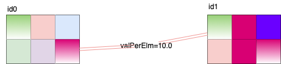


then this ValuedPair contributes 10 * 2 = 20 points to the overall objective function. 
The factor `2` here is the number of positions where `id0` and `id1` have the same mapping (top-left and bottom-right corner elements). 

Note that the objective function is defined elementwise, so the 2 Tensors don't require the same mapping for *all* indices to contribute to the objective function. 
In the above example, only 2 out of the 6 elements have the same mapping. If all 6 had the same mapping, the ValuedPair would contribute 10 * 6 = 60 points. 

The objective function is the weighted sum over all ValuedPairs of the number of elements which have the same mapping, described in Python as


```python
objectiveFunctionScore = 0
# For all the ValuedPairs which have been registered to the Graph,
for p in allValuedPairs:
   # For every row-major flattened index in the shape of the Tensors in the ValuedPair, 
   for i in range(tensor(id0).numElements()):
       # If the mappings at the index match, add p.valPerElm to the objective function. 
       objectiveFunctionScore += p.valPerElm * (mapping(id0)[i] == mapping(id1)[i]))
```

For an Op such as a matmul which has an input with a specific target layout prescribed by the backend, a user must insert a **Source** Tensor into a Graph which has this prescribed layout.
The Source Tensor must then be *tied* to the actual Op input in a ValuedPair. 
Thus for every Tensor which has a specific target layout, there must be one corresponding Source Tensor, and one ValuedPair. 
The basic idea is illustrated below.


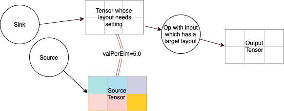

The parallel red lines between the 2 Tensors in the Figure above denotes a ValuedPair with valPerElm of 5 connecting them. 
The different colors denote different mappings of the elements. 
The Graph in the Figure above can be constructed with

```c++
Graph g;
Shape shape({2, 3});
auto sinkTensorId   = g.sink0(shape);
auto sourceTensorId = g.source0(shape);
g.insertValuedPair(sinkTensorId, sourceTensorId, 5.);
auto outId = g.barrier({sinkId}, {shape});
```

We will discuss the call *g.barrier(..)* later. Once a Graph has been constructed, an *algorithm* must be run which sets the layouts of Sink Tensors to try and maximize the objective function. The current API for this is

```c++
auto soln = graph.setPath(Graph::Algo::Greedy0);
```

In the above case, the Greedy0 algorithm will run, and it will find that the Sink Tensor should have the same layout as the source Tensor to maximize the objective function, so that the Graph will look as follows, with colors again denoting mappings:

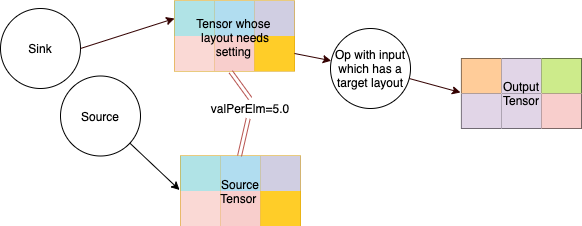

With this solution, the objective function will be `6 * 5.0 = 30.0`. As one final example of computing the objective function for a given Graph with complete layouts, consider


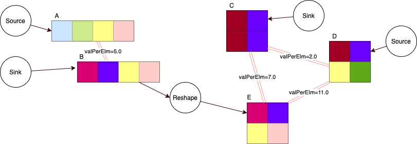

The value of the objective function with the layouts above is made up the contributions from four ValuedPairs. Their conntributions are

| ValuedPair                | Number of elements with same mapping | Contribution |
| ------------------------- | ------------------------------------ | ------------ |
| (A, B, 5.0)               | 2                                    | 10.0         |
| (C, D, 2.0)               | 2                                    | 4.0          |
| (C, E, 7.0)               | 1                                    | 7.0          |
| (D, E, 11.0)              | 1                                    | 11.0         |

and so the value of the objective function is 10.0 + 4.0 + 7.0 + 11.0 = 32.0.

Exercise: What is the maximum obtainable value for the objective function? Answer: 85.0. Can you see why?


## How layouts flow through Ops ##

So far we have met the two types of Op which create input Tensors for this project's Graph class; Source Ops and Sink Ops. 
Next we'll introduce the various **unwindable Ops**: Reshape, Reverse, DimShuffle, SubSample, Slice, Concat, and their relatives. 
These are the Ops for which there is a 1-to-1 relationship between input Tensor mappings and output Tensor mappings. 
That is, the mapping of any input (output) element can be determined directly from a single output (input) element's mapping.
In the Figure below, the mappings of the elements in a Tensor are mapped through various unwindable Ops. 

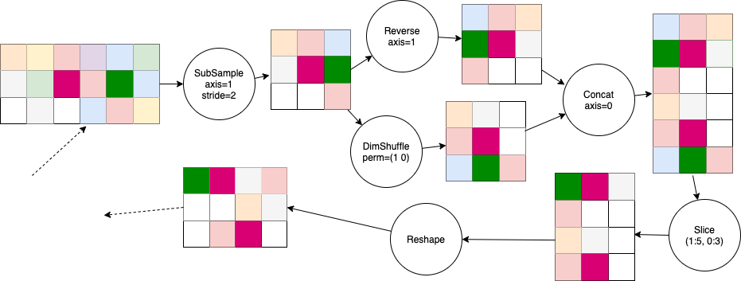

This project's name, **unwinding**, derives from the way a path is traced from a Tensor with a known layout, back through the Graph to a Sink Op. Consider the following example,

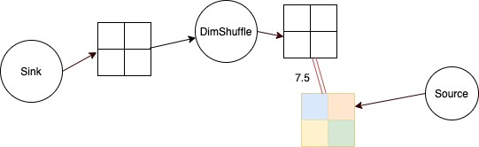

To obtain the 7.5 * 4 = 30.0 points available, we must ensure that the output of the DimShuffle has the same layout as the Source Tensor. This means we the Sink Tensor must be the Source Tensor *unwound* through the DimShuffle:

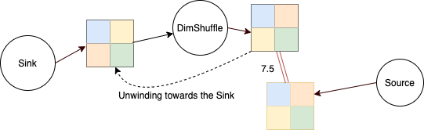

Unwinding thus involves applying the inverse of Ops in reverse order. The inverse for each Op is:

| Op                        | Inverse                           |
| ------------------------- | --------------------------------- |
| DimShuffle(permutation)   | DimShuffle(permutation.inverse()) |
| Reverse(axis)             | Reverse(axis)                     |
| Slice                     | SettFillInto                      |
| SubSample                 | SettFillInto                      |
| Reshape                   | Reshape                           |
| Concat                    | Slice                             |

The **SettFillInto** Op performs a kind of scatter, where only a subset of the elements in the output have mappings. 
More information on how Slice, SubSample, and SettFillInto are related can be found here (TODO). 

## When layouts do not flow through Ops ##

Sometimes, there is not a simple 1-to-1 mapping between the mappings of inputs and outputs. In this project we've divided this into 2 cases. 

### Barrier Ops ###

The first case is what we call a **Barrier** Op. 
These are Ops, used to represent for example batch normalization and max pooling with the Poplar API, where the mapping of layouts between inputs and outputs is *backwards-opaque*, and *forwards-non-local*. 
Let's explain these 2 *terms*. 
*Backwards-opaque* means that it is impossible to determine the mapping of any input element from any set of output elements' mappings. 
*Forwards-non-local* means that the mapping of an output element depends on the mappings of all the input elements. 
This means it isn't possible to know the layout of any output elements until *all* of the input elements' tile mappings are known. 


### FixedPoint Ops ###

The second case is what we call a **FixedPoint**. 
This type of Op is similar to a Barrier, but it is not forwards-non-local. 
The layout of the output is completely independent of any of the inputs, and so layouts can be derived from the output of a FixedPoint operation before any of the FixedPoint's inputs' layouts are known.
The advantage of using a FixedPoint Op instead of a Barrier Op is that the layout of upstream Tensors can be derived from downstream Tensors. 
The FixedPoint Op is a useful but not strictly necessary abstraction, as it can be implemented as a Source Op. 


Most of the core Ops for describing the unwinding problem have been introduced now, so let's look at some examples. 

## Matrix multiplication ##

Suppose the computation is
```
out = matmul(X.dimShuffle(perm), concat(Y, Z.reverse(dims)))
```

This is a Graph with 3 inputs which need their layouts set: `X`, `Y`, and `Z`. 

In Poplar, the two input Tensors to a matrix multiply have prescribed target layouts, each with its own special API for creating a poplar Tensor. 
For example, the API for creating a Tensor with the prescribed layout for the second input to a matmul is

```c++
poplar::Tensor createMatMulInputLHS(poplar::Graph &graph,
                                    const poplar::Type &dataType,
                                    const std::vector<std::size_t> &aShape,
                                    const std::vector<std::size_t> &bShape,
                                    ...);
```


For each of the input Tensors in this project's Graph, we'll therefore have a ValuedPair. 
In Poplar, the layout of the output of a matrix multiply is independent of the inputs, and so it is best modelled as a **FixedPoint** Op. 
The Graph describing this unwinding problem thus looks as follows, with the different colors denoting known mappings. 


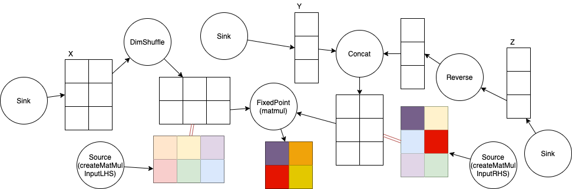


We have 3 Tensors with known layouts in the initial Graph: the 2 Source Tensors and the output of the FixedPoint. There are 2 ValuedPairs, each corresponding to an input to the matrix multiplication. The optimal solution for this problem, which maximizes the objective function, will look like;

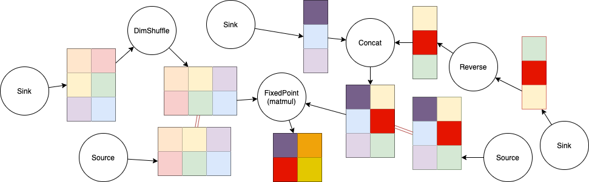

This solution is obtained by any simple algorithm which unwinds from the Sources to the Sinks. 


## Unbroadcast adds ##

In the matrix multiplication example, we discussed the case where an Op has a backend-prescribed layout, for each of its inputs. In this example, we consider the case where there is no specific target layout, but it is advantageous for 2 Tensors to have the *same* layout, irrespective of what that layout is. On an IPU, when adding 2 Tensors of the same shape, if the corresponding elements are on different tiles, then there is an inter-tile copy required before they can be added. It's therefore advantageous for corresponding elements to be on the same tile. To encode this in our objective function, we add a ValuedPair with the 2 inputs, which will make the maximum of the objective function correspond to the case where to the 2 Tensors have the same layout. 

Consider the computation 
```
Out = matmul(A, B) + C. 
```
We model the matmul as a Barrier in this example, although as discussed previously it would be advantageous to model it as a FixedPoint. 

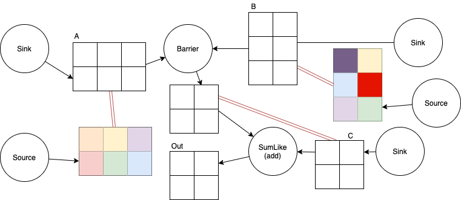

There is a new type of Op in this Figure; a **SumLike** Op. SumLike Ops can be used to model any variadic elementwise Op, such as elementwise multiply, sum, divide, etc. It is unwindable through only 1 input index. A good solution to the above Graph will look like, 


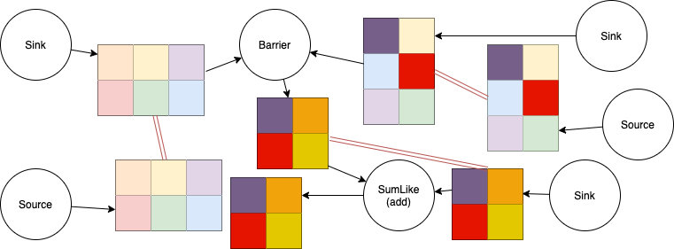


With this solution, the objective function is maximized: all 3 ValuedPairs are satisfied for all elements. Note that there is a constraint on the order in which the layouts are chosen here, as is always the case when a Barrier Op is used -- the layout of the output of the Barrier Op can only be set after the layouts of the Barrier Op's 2 inputs have been completely set. 

## Broadcast adds ##

Consider now the case of a SumLike Op where the 2 Tensors are not of the same shape, but where one is numpy-broadcastable to the other. 
An example is adding a bias term onto an activation Tensor, where the bias is for example of shape (6,1) and the activation Tensor is of shape (20,20,6,3). 
(6,1) is numpy broadcastable to (20, 20, 6, 3), as can be seen by the following alignment,
```
(.., .., 6, 1)
(20, 20, 6, 3)
```

In this broadcast case, there may still be a preferred layout for the bias Tensor in terms of the activation Tensor it is being added to. 
In Poplar for example, there is an API for creating a prescribed layout for a 1-d bias Tensor based on the layout of the activation Tensor:

```
poplar::Tensor
createBiases(poplar::Graph &graph, const poplar::Tensor &activations,
             const poplar::DebugContext &debugContext = {"biases"});
```


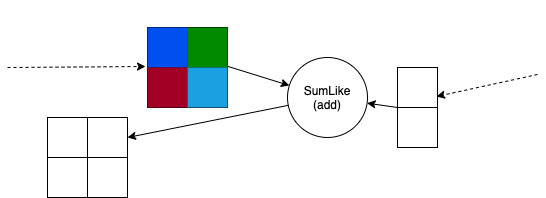

ValuePairs can only be created for Tensors with the same shape, so we cannot tie the 2 inputs to the add with a ValuedPair, as was done for the unbroadcast add. 
We instead introduce a new Op, **SumLikeReduce** whose output is the same size as the smaller of the SumLike input Tensors (the bias).
The output of the SumLikeReduce is tied to the smaller argument of the SumLike Op. 
The SumLikeReduce Op is nothing more than a Barrier Op with a "hook" to the underlying library -- Poplar in our case -- defining how to set the layout of its output. 

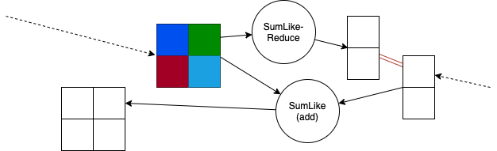

With the ValuedPair in the Graph, the optimal layout for the SumLike Op looks like

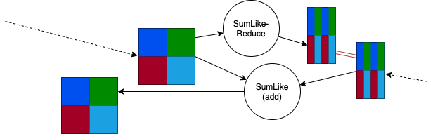


## Call copies ##

Another situation where it is advantageous for 2 Tensors to have the same layout, is when there is copy from one to the other. 
This is advantageuous for the same reasons as described in the unbroadcast add case, which on an IPU is to minimize inter-tile communication.
In particular, when copying a Tensor into or out of a subgraph, it is advantageuous if the source and destination Tensors have the same layout. 

Suppose that the subgraph which is called is
```
 Call(a, b) = matmul(a.transpose(), b.reshape((2,3))),
```

and that the supergraph (callee) is
```
 sumOut  = Call(A, B) + Call(C, D).
```

Diagramatically,

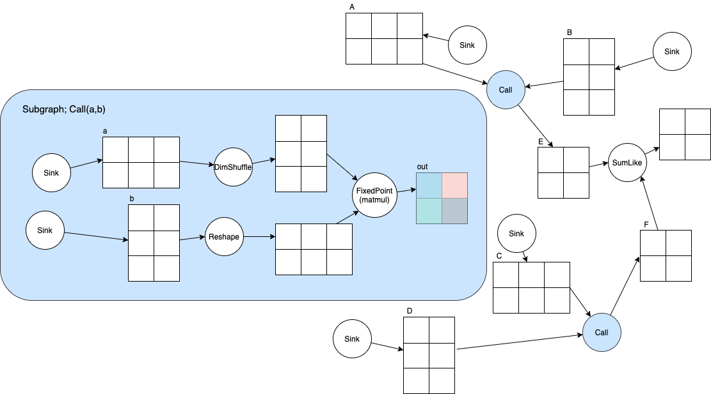

There are 4 copies into the subgraph: `A -> a`, `C -> a`, `B -> b`, `D -> b`, and 2 copies out of the subgraph: `out -> E`, `out -> F`. 
To encourage solutions which have the sources and destinations of copies have the same layout, these 6 copies should have ValuedPairs connecting their ends. 
In this particular Graph there are also 2 ValuedPairs for the matrix-multiply input and output, and 1 ValuedPair for the sum at the end. 
There are therefore 9 ValuedPairs in total, as illustrated below. 


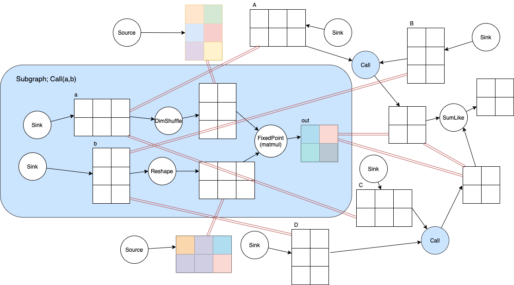


There is 1 layout solution which satisfies all 9 ValuedPairs, maximizining the objective function. It is shown below. 

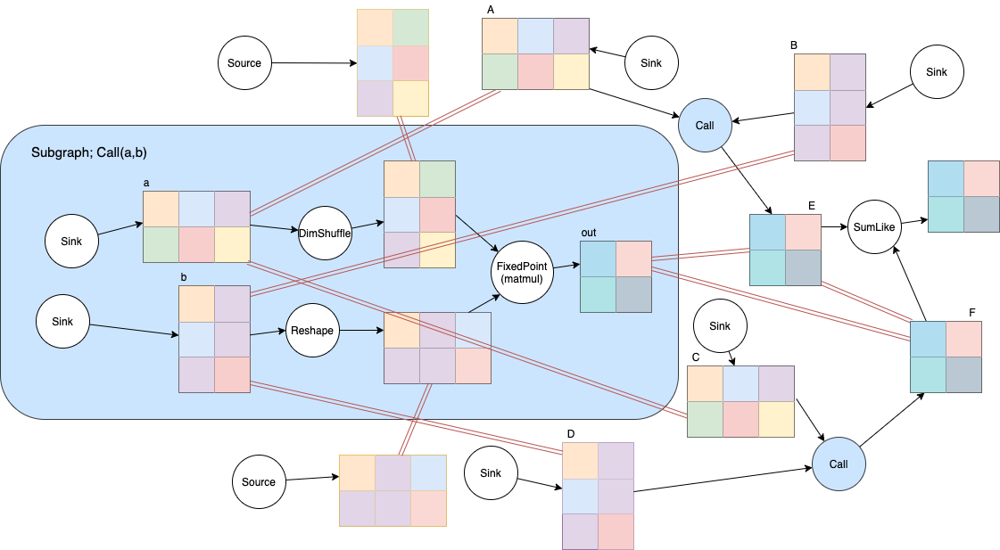


The Graph above with 9 ValuedPairs looks quite complex, and while inserting all ValuedPairs one-by-one is possible in this project, it is probably error prone. 
There are therefore some helper methods the Graph class to make it easier, such as *call*. Other operations which have subgraphs, such as loops and conditionals, will follow the same design. 

Note that the outputs `E` and `F` are actually Sink Tensors, and therefore it is required to set their layouts. 


## Motivation for FixedPoints ##

Recall the distinction between FixedPoint and Barrier Ops; 
the layout of a FixedPoint's output is independent of the input layouts, whereas the layout of a Barrier's output depends on the layouts of the inputs. 
This means that Tensors preceding a FixedPoint can have their layouts derived from it's output. We'll now present a case where this distinction is important. 
The model's subgraph is

```
Call(x) = matmul(w, x)
```

and the supergraph is
```
out = Call(Call(Call(input)))
```

Diagramatically, it looks as follows. 

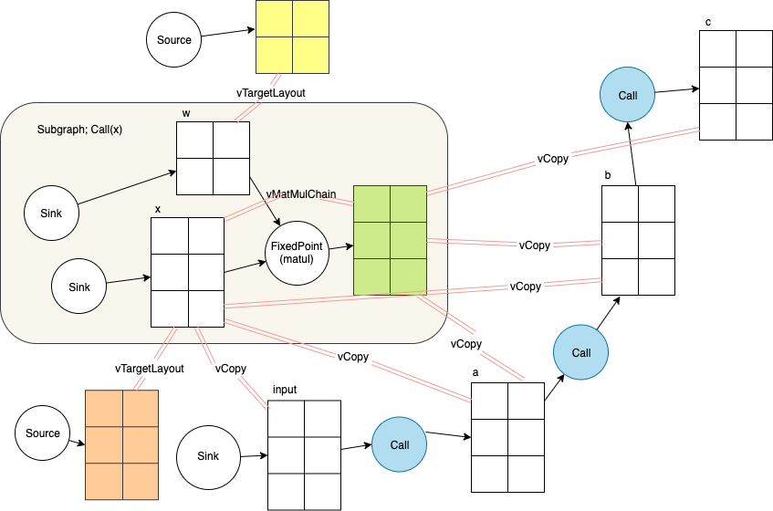

The parallel lines connecting Tensors in the Figure are ValuedPairs. They've been divided into 3 valPerElm levels. 
Firstly, there are the ValuedPairs associated with the copies into and out of the subgraph, with a value per element of `vCopy`. 
Next, there are the 2 ValuedPairs connecting the matmul inputs with the prescribed target (Poplar) layout, with a value per element of `vTargetLayout`. 
Finally, there is a ValuedPair connecting the matmul's non-weight input to its output. 
This one is new: we know that Poplar's matmul is designed to perform well when chained, and so setting the input's layout based on the output's layout should be quite a good choice. 

The Tensors which need their layouts set are `w`, `x`, `input`, `a`, `b`, and `c`. Let's consider 2 solutions, which are both optimal for certain values of `vCopy`, `vTargetLayout`, and `vMatMulChain`. 

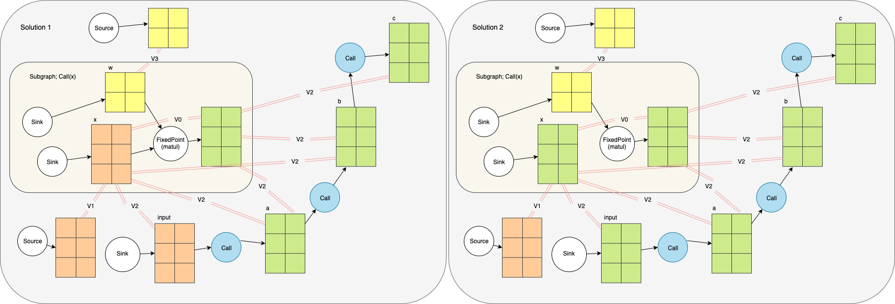

In Solution 1 (left), the layout for the (lhs) input to the matmul is chosen to be the prescribed target layout. The objective function score with this is

```
10 *vTargetLayout + 24 * vCopy
```
It is easy to see that this is the score by looking at all the ValuedPairs and checking if the layouts (colors) are the same for the 2 Tensors being connected. 

In Solution 2 (right), the layout for the (lhs) input to the matmul is chosen to be the same as the layout of the matmul output. In this case, the score is

```
4 * vTargetLayout + 6 * vMatMulChain + 36 * vCopy. 
```

Solution 1 is therefore optimal when 
```
6 * (vTargetLayout - vMatMulChain) > 12 * vCopy. 
```

It will be users responsibility to choose the 3 scalar values `vTargetLayout`, `vMatMulChain`, and `vCopy`. It will be this project's responsibility to find the solution which maximizes the objective function!

## What's next? ##

Hopefully this brief introduction to unwinding has given you a basic idea of what the problem is, and how we try to solve it. A good place to get even more familiar with unwinding is the unwinding test directory. 

TODO: spend more time describing the actual algorithms used to solve the problem. 

