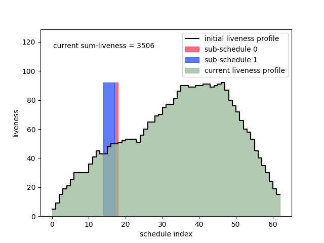

The poprithms::schedule::shift algorithm iteratively rearranges the order in which operations are scheduled, reducing the overall memory required. 

Starting from a valid schedule, the algorithm looks for rotations (shifts) of contiguous sub-schedules which reduce sum-liveness. For example, for an initial schedule 

```
   a  b  c  d  e  f
```

the sub-schedules `b  c  d` and `e  f` can be rotated, rearranging the schedule from 


```
   a  b  c  d  e  f  (i)
      =======  ----
```

 to

```
   a  e  f  b  c  d  (ii).
      ----  =======  
```

The algorithm will keep schedule (ii) if it has better liveness than (i). Below is an animation of the algorithm at work on [this graph with recomputation](./recompute/demo.md).

It shows all of the sum-liveness reducing rotations which are applied, but not the liveness-increasing rotations which are considered and not applied. 

Other interesting Graphs are [this random tree](./tree/demo.md), [this bifurcacting graph](./bifurcating/demo.md), [this graph on gride](./grid/demo.md), and [this random graph with non-local allocations](./adversary/demo.md)




The core of the algorithms is simple, and can be expressed in Python code as:

```Python

def isValid(start0, subLength0, subLength1):
  """
  Using the example above:

   a  b  c  d  e  f  (i)
      =======  ----
   
  start0 is 1 (the index of the operation 'b')
  subLength0 is 3 (the number of operations in =====)
  subLength1 is 2 (the number of operations in ----)
  """

  validRange = start0 + subLength0 + subLength1 < nOps

  # Are all the topological constraints between operations satisifed after the rotation? 
  constraintsSatisfied = allTopologicalConstraintsSatisfied(start0, subLength0, subLength1)

  return validRange and constraintsSatisfied
       

def isLivenessReducing(start0, subLength0, subLength1):
   """
   Using the example above, does (ii) have better liveness than (i)? 
   There is more information on this in the explanation below this code example. 
   """

def rotate():
  for subLength0 in range(nOps):
    for start0 in range(nOps): 
      for subLength1 in range(nOps):
         if isValid(start0, subLength0, subLength1) and isLivenessReducing(start0, subLength0, subLength1):
            applyRotation(start0, subLength0, subLength1)
            return True
  return False

while rotate():
  print("sum-liveness reduced!")
```

Implemented directly, the algorithm is slow. However, there are numerous optimizations which allows the algorithm to rapidly find good liveness reducing rotations. These optimizations are why the codebase is reasonably complex. Some of the optimizations are discussed [in this page](./optimizations.md). 


A graph is made up of Ops and Allocs. Ops are the nodes in the graph which must be scheduled. Allocs represent blocks of memory of different sizes. Each Op is associated to a set of Allocs, which it requires when it is executed. These might correspond to input/output tensors, for example. In the other direction, each Alloc is associated to a set of Ops, which require it. 

The objective of the algorithm is to schedule the Ops to minimize the duration that Allocs are live, weighted by their sizes. The duration that an Alloc is live is the distance from the first Op in the schedule which requires it, to the final Op which requires it. 

For a proposed rotation to be accepted and applied,
1) all topological constraints between Ops must be satisfied, and
2) The sum over all Allocs of `duration*size` must decrease.

Using the example above, if the Ops (lowercase) require Allocs (uppercase) as follows:

```
a: A
b: A, B
c: A, B, C
d: A, B, C, D
e: A, E
f: E
```

and all Allocs have size 1, then the liveness for (i) of each Alloc is 

```
A : 5  (live for a->e, 5 steps)
B : 3  (live for b->d, 3 steps) 
C : 2  (live for c->d, 2 steps)
D : 1  (live for d->d, 1 step)
E : 2  (live for e->f, 2 steps)
```

with sum-liveness of 13. For (ii) they are

```
A : 6 (live for a->d, 6 steps)
B : 3
C : 3
D : 1
E : 2
```

with sum-liveness of 15. So the sum-liveness increases from 13 to 15, and so this shift is rejected. 

How are shifts proposed? Shifts involving a single Op are first considered. An example is the rotation from 

```
   a  b  c  d  e  f 
      =======  -
```

 to

```
   a  e  b  c  d  f 
      -  =======  
```

We call shifts where the smaller of the sub-schedules is of size 1, 1-shifts. When there are no remaining 1-shifts which decrease sum-liveness, 2-shifts are considered, and so on. The algorithm climbs up the "n-shift ladder", until there are no shifts of any size which decrease liveness. At this point the algorithm either returns to 1-shifts, or terminates. More details on the ladder climbing this can be found [in this page](./ladderclimbing.md)

For many examples, including all of the examples above, the local minimum obtained is the global minimum. There are however graphs for the which the sum-liveness of the final minimum depends on the precise order in which rotations are considered. This means that the local minima are not global minima, which is not surprising as the problem is NP-complete.

Technically, the algorithm presented is simulated annealing, with zero temperature (T=0). We could extend this to do true annealing, where sum-liveness shifts (T>0) are accepted with a certain probability, and then taper down to T=0 as the algorithm proceeds. However in my experience running with T=0 from the start does a good job in current experiments, and so there is not plan to implement the algorithm with T>0. 

More information will be added later!

