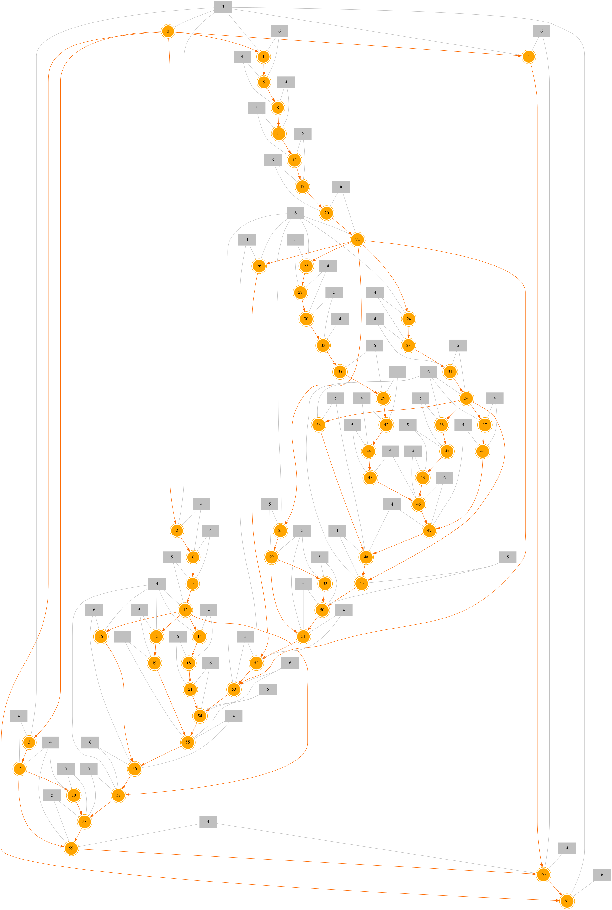

The graph being scheduled is shown below. The grey boxes denote allocations, with the number in the box denoting the allocation's size. The circles denote the nodes (ops).



The initial (random) schedule is 

```0 2 4 6 1 3 9 7 12 10 16 15 5 8 14 18 21 11 19 13 17 20 22 24 25 26 29 23 28 32 31 34 36 37 38 27 40 43 41 30 33 35 39 42 44 45 46 47 48 49 50 51 52 53 54 55 56 57 58 59 60 61```

The sequence of sum-liveness reducing rotations (shifts) looks like:


and the final schedule, after all rotations are applied is, 

```0 1 5 8 11 13 17 20 22 23 27 30 33 35 39 42 44 45 24 28 31 34 36 40 43 46 37 41 47 38 48 49 25 29 32 50 51 26 52 53 2 6 9 12 14 18 21 54 15 19 55 16 56 57 3 7 10 58 59 4 60 61```